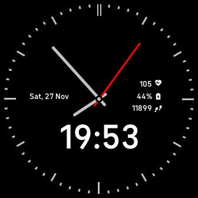

# Chronosphere_Model_99
Clock Face for Fitbit Sense/Versa 3

[](https://gallery.fitbit.com/details/10e8ed37-d7ae-4589-991c-701123e0cbad)


## Prerequisites

To build this project on your local machine, you need `npm`, Fitbit SDK and Fitbit OS Simulator if you like to run this project on a simulator.

Also, Fitbit has an online editor (Fitbit Studio) that you is easy to use in order to develop your application online.

```text
https://docs.npmjs.com/downloading-and-installing-node-js-and-npm
```
```text
https://dev.fitbit.com/release-notes/fitbit-os-simulator/
```
```text
https://studio.fitbit.com/
```
## Installing

You have to clone the repository to your local machine

```shell
git clone https://github.com/elspoka/Chronosphere_model_99.git
```

Go to project folder

```shell
cd Chronosphere_Model_99
```

Build dependencies

```shell
npm install
```

Build the application

```shell
npx fitbit-build
```

Connect to the simulator

```shell
npx fitbit
```

Install the built application to the simulator

```shell
install
```

If everything goes well and there is no error in the terminal logs, you will see the similar image like below in your Fitbit simulator.



## Built With

* [Fitbit SDK](https://dev.fitbit.com/getting-started/) - To develop applications or clock faces for Fitbit devices.
* [Fitbit OS Simulator](https://dev.fitbit.com/release-notes/fitbit-os-simulator/) - To see the application or clock faces on a local simulator.

## Issues

Feel free to create an issue if you find any problem or if you have any idea that you think it will be nice to add.

## Authors

* **Ilias Kalantzis** - [github/elspoka](https://github.com/elspoka)
